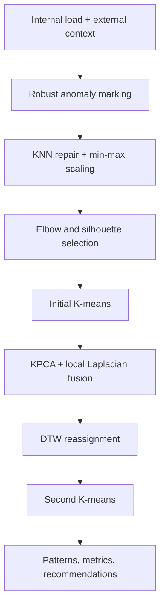

# Industrial Park Load Pattern Analysis

A reproducible Python implementation inspired by Chinese patent application
**CN119622383A**, “Method and system for industrial-park load analysis based
on optimized K-means clustering.”

> Scope and evidence: the supplied patent package contains documents and
> figures, but no source code or raw industrial measurements. This repository
> is therefore an independent engineering prototype evaluated on labeled
> synthetic data. It does not claim production validation or a fixed 21%
> accuracy improvement.

## What the system does

1. Builds 24-hour load curves for three park archetypes: energy-intensive
   manufacturing, distributed-energy users, and EV charging.
2. Injects missing values and sensor anomalies for a controlled evaluation.
3. Repairs bad observations with distance-weighted KNN and applies min-max
   normalization.
4. Selects the cluster count while reporting the elbow (WCSS) curve.
5. Fuses nonlinear global KPCA features with a k-NN graph-Laplacian local
   embedding (an implementable interpretation of KPCA-KLPP).
6. Uses Dynamic Time Warping to reassign phase-shifted daily curves.
7. Runs a second K-means pass and compares it with baseline K-means using
   Adjusted Rand Index (ARI) and silhouette score.

## Architecture



## Quick start

```bash
python -m venv .venv
# Windows: .venv\Scripts\activate
# macOS/Linux: source .venv/bin/activate
pip install -e ".[dev,dashboard]"
industrial-load-demo --seed 42
pytest
streamlit run app.py
```

The CLI writes `results/metrics.json` and `results/clustered_loads.csv`.

## How to explain this in an RA interview

**Problem.** Industrial-park demand is heterogeneous, nonlinear, time-shifted,
and frequently incomplete. Plain Euclidean K-means is sensitive to all four.

**Design choice.** KNN repair addresses missing/error observations; KPCA models
nonlinear global structure; the graph Laplacian preserves local neighborhoods;
DTW handles the same operating pattern occurring at slightly different times.

**Evaluation.** ARI is used because cluster numbers are arbitrary and the
synthetic generator supplies hidden ground-truth archetypes. Silhouette is an
internal metric for real unlabeled deployments. A single accuracy percentage
without a labeled dataset, baseline, seeds, and confidence interval would not
be defensible.

**Production next step.** Replace the generator with 15-minute smart-meter,
weather, tariff, equipment, and renewable-generation feeds; fit on a time-based
training window; validate stability across seasons; then connect discovered
patterns to peak-shaving and capacity-planning rules.

## Patent-to-code traceability

| Patent stage | Repository implementation |
|---|---|
| (1) cleaning and normalization | `preprocessing.py` |
| (2) optimal cluster count / elbow | `pipeline.py::_select_k` |
| (3) initial K-means | `pipeline.py` |
| (4) KPCA-KLPP feature fusion | `features.py` |
| (5) DTW cumulative distance | `dtw.py` |
| (6) reassignment and second clustering | `pipeline.py` |
| system presentation | `app.py` |

## Limitations

- Synthetic profiles demonstrate mechanics, not grid readiness.
- The patent describes mathematical objectives but does not provide executable
  KLPP code or complete experimental parameters; the graph-Laplacian component
  is documented as an engineering interpretation.
- K selection uses silhouette as a reproducible tie-breaker while still
  exposing WCSS for elbow inspection.
- DTW is quadratic in curve length and should be approximated or batched for
  very large fleets.

## Reference

CN119622383A, published 2025-03-14. Applicants: Wuhan Hengda Electrical Co.,
Ltd. and Wuhan Institute of Technology.

